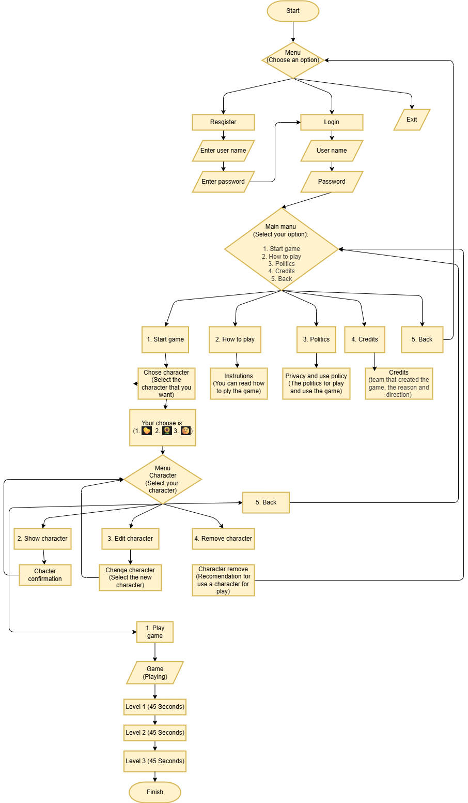

## About the game

Welcome to MazeQuest the Console Maze Game

MazeQuest is a real-time console maze game where the player controls the character 🐤/🌻/🌝 through a maze filled with walls and paths until reaching the goal 🏆.  
The game features non-blocking keyboard input (no need to press Enter), live rendering, and a running timer handled in a separate thread.

---

## 🎮 Main Features

- Real-time movement without pressing Enter
- Fully compatible with **Windows, Linux, and macOS**
- Map loading from external '.tx' files
- Timer running on a separate thread
- Multiple difficulty levels (easy, medium, hard)
- File-based maze management
- Clean and responsive console 

---

## 🧩 How to Play

Use the following keys to move:

- **W** → Up  
- **A** → Left  
- **S** → Down  
- **D** → Right  

Game symbols:

- **🐤/🌻/🌝** → Player  
- **🔲** → Wall  
- **⬛** → Path  
- **🏆** → Goal  

Reach the goal as fast as possible while the timer continues running.

---

## ▶️ How to Run the Game

1. Install Python 3.10 or later.
2. Make sure the following files are in the same folder:
   - 'main.py'
   - 'map#.txt' (your maze files)
   - 'crud.py'
   - 'auth.py'
   - 'end_of_the_game.py'
   - 'game.py'
   - 'menu_game.py'
   - 'time_counter.py'
   - 'bd.json'
   - 'README.md'
   - 
3. Run the game from the terminal:

- bash
python3 main.py

- On Windows
python main.py

## 📦 External Libraries Used

No external libraries are required.
The project uses only Python’s built-in modules:

- os
- threading
- time
- termios (Linux/macOS)
- tty (Linux/macOS)
- select (Linux/macOS)
- msvcrt (Windows)
- atexit

## 💾 Information Management

MazeQuest uses simple but effective file-based data management:

✔ Map files (.txt)

Each map is stored as a text file where each symbol represents a different element inside the game:

Symbol	        Meaning
🐤/🌻/🌝	    Player
🔲	            Wall
⬛	           Walkable path
🏆	            Goal

Maps are loaded dynamically at runtime, allowing easy level switching and customization.

✔ Timer thread

The game runs a timer in a separate thread, ensuring the clock continues even while waiting for movement input.

✔ Cross-platform keyboard handling
- On Windows: msvcrt.getch() and msvcrt.kbhit()
- On Linux/macOS: termios + tty + select
- Unified through wrapper functions so the game works identically across platforms

✔ Game loop rendering

The game redraws the entire maze each cycle for a real-time effect.

## 🔀 Game Flow Diagram

